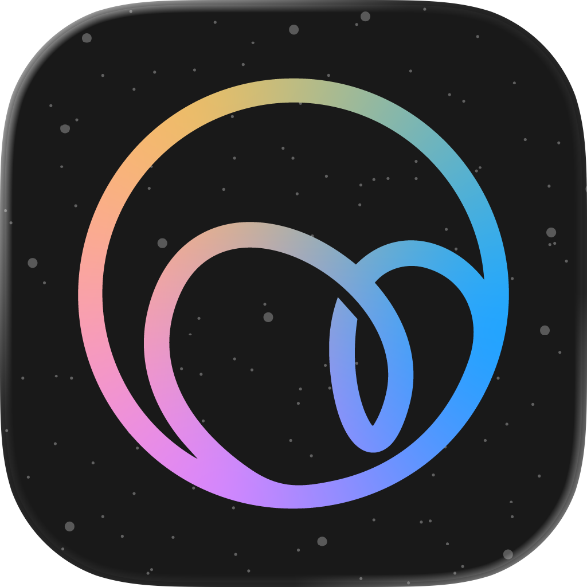
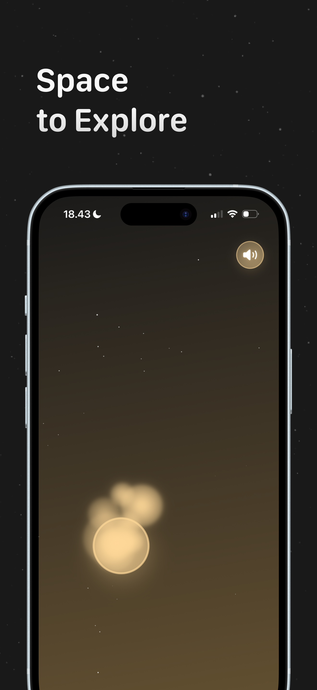
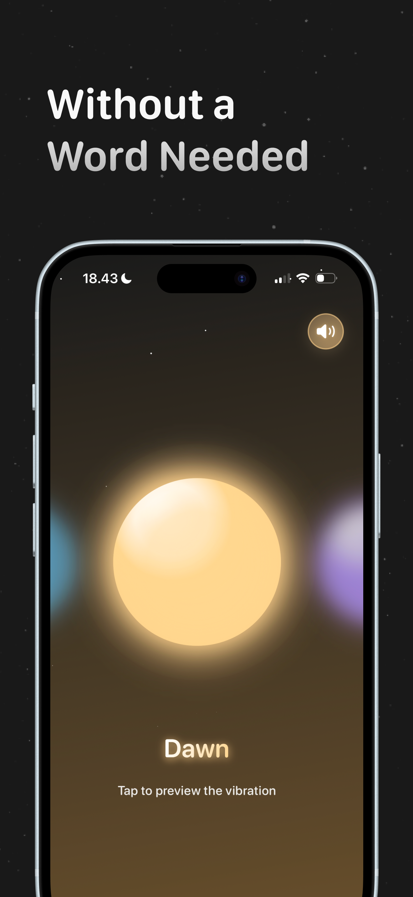
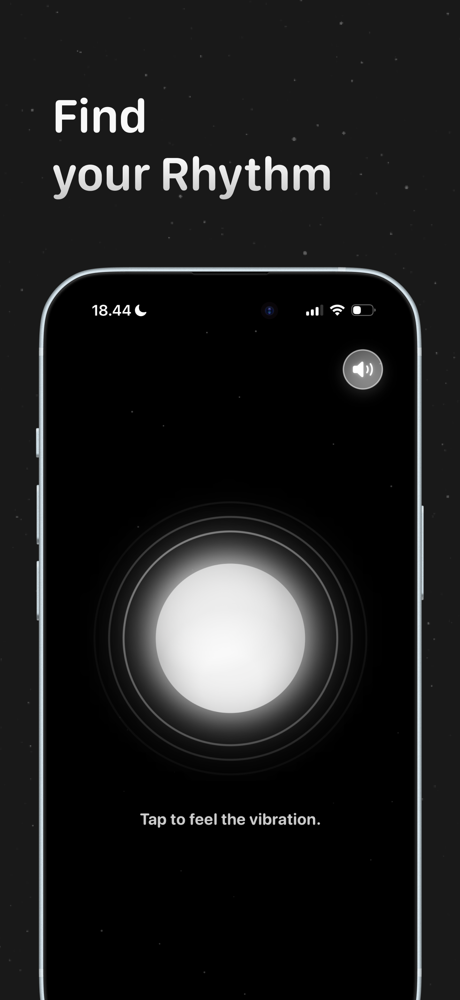

# Buzzle: Buzzing Bubble

  
  
  ### Feel every pop in your hands.
  
  
  
  

## 📱 About

Take a time to step back from the crowdedness of reality. Buzzle is a space for you to be immersed in present moment, let your hand be the creator of your expression.

Experience a calming, immersive bubble-popping experience with haptic feedback that helps you relax and find peace in the present moment.

## ✨ Features

- 🎯 **Immersive Experience** - Feel every pop through advanced haptic feedback
- 🧘 **Mindfulness Tool** - Step back from daily stress and focus on the present
- 🎨 **Creative Expression** - Let your hands create unique patterns and rhythms
- 🔒 **Privacy First** - No data collection, your experience stays private
- 📱 **Cross-Platform** - Available on iPhone, Mac (M1+), and Apple Vision

## 📸 Screenshots

  
  
  

## 🎯 Why Buzzle?

The buzzing helps you to calm down! Buzzle provides a simple yet effective way to:

- Reduce stress and anxiety
- Practice mindfulness
- Take mindful breaks throughout your day
- Create a moment of peace in a busy world

## 📋 Requirements

- iOS 18.2 or later
- macOS 15.2 or later (Mac with Apple M1 chip or later)
- visionOS 2.2 or later

## 🔄 Latest Updates

### Version 1.0.1
- Bug fixes
- Improved typography
- Updated haptic patterns for better experience

## 🔐 Privacy

Your privacy matters. Buzzle does not collect any data from users. What happens in Buzzle, stays in Buzzle.

[View Privacy Policy](https://sites.google.com/view/buzzle-privacy/)

## 📥 Download

## 👥 Team

### Developers
- Henokh Abhinaya T Jahjadi
- Muhammad Zhafran
- Utari Dyani Laksmi

### Designers
- Angel Aurelia
- Joan Draku
- Felly Juvencia

## 📄 License

Copyright © 2025 Buzzle Team

---

  Made with ❤️ for mindful moments

